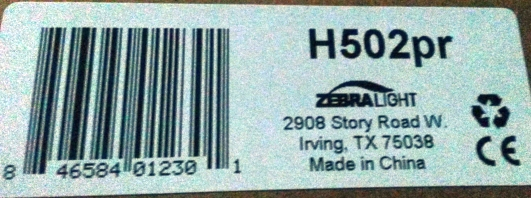

= ZebraLight 502 Photo Red
:toc:
:sectnums:
:toc-placement!:
:toclevels: 2

toc::[]

ZebraLight link: http://www.zebralight.com/H502pr-Photo-Red-AA-Flood-Headlamp_p_175.html

== Related discussions

* http://www.candlepowerforums.com/vb/showthread.php?412892
* http://www.candlepowerforums.com/vb/showthread.php?198304

== Which one is the Photo Red?

H502pr compared to H501r

White sheet in between.

The camera cannot give back true colours, but even there the difference is striking.

image:20170311_183657_Richtone(HDR).jpg[]

image:20170311_183801.jpg[]

image:20170311_184044.jpg[]

== Manuals

The manuals also seem to differ:

According to the leaflet

1. strobe is accessed with triple click
1. there are _several_ strobe modes

link:USER_GUIDE_V30_2012.pdf[]

image:20170311_185915.jpg[]
image:20170311_185942.jpg[]

I have the impression that I was sent

* a unit with a problematic UI (cannot triple-click to get strobe mode, cannot access to "various" strobe modes). one strobe mode is available if going to H1 and double-clicking (provided you programmed H2 to strobe mode).
* a leaflet that does not entire correspond to the PDF (which is most probably outdated) and to the unit
* note that the UI _does_ report the voltage (4x click)

== Attempts to get an idea of wavelengths

=== Using DVD and CD

See link:./grating/[]

== Conclusion
Until further notice, don't buy a Zebralight ZLH502pr if you expect a "deeper red". It doesn't make a difference; on the contrary there are other LED lights in the ZL range that provide this. Also, the UI is messy.

I contacted ZL and am waiting for their answer.