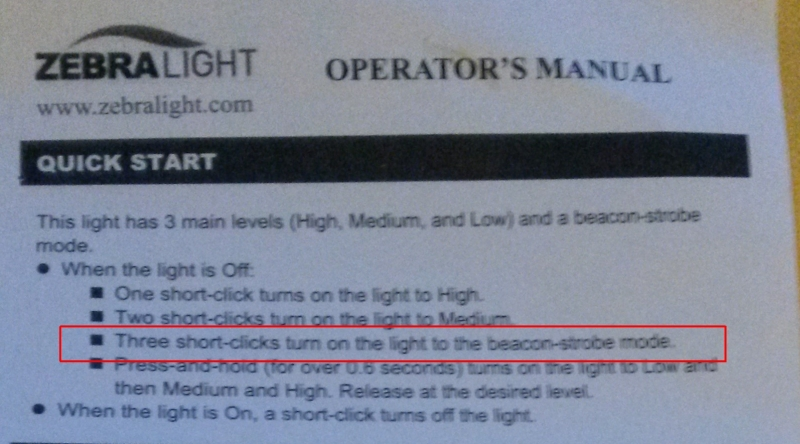
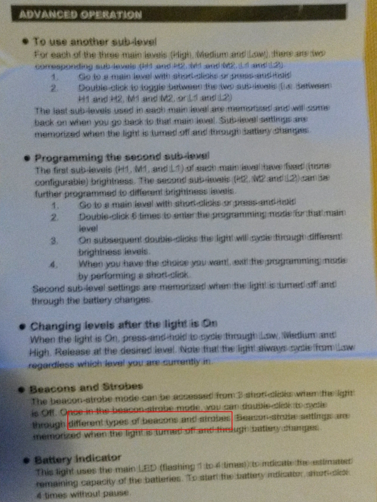

= ZebraLight 502 Photo Red
:toc:
:sectnums:
:toc-placement!:
:toclevels: 2

toc::[]

ZebraLight link: http://www.zebralight.com/H502pr-Photo-Red-AA-Flood-Headlamp_p_175.html

image:20170311_190027.jpg[]

== Which one is the Photo Red?
White sheet inbetween.
The camera cannot give back true colours, but even there the difference is striking.

image:20170311_183801.jpg[]

== Manuals

The manuals also seem to differ:

According to the leaflet

1. strobe is accessed with triple click
1. there are several strobe modes

link:USER_GUIDE_V30_2012.pdf[]

I have the impression that I was sent

* an old unit
* with a new leaflet

But the 4-click mode does return the battery status...