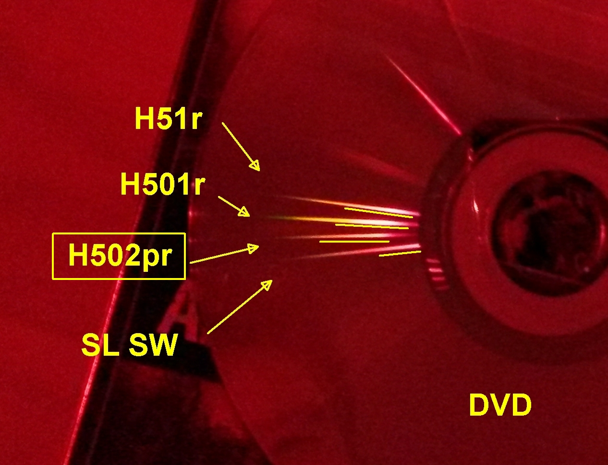

= Wavelength via gratings
:toc:
:sectnums:
:toc-placement!:
:toclevels: 2

toc::[]

== Setup

== DVD

First, subjective impressions:

* SL (StreamLight SideWinder) indeed has the deepest red
* H51r is indeed deeper than 502pr
* H501r has more distribution, which explains why it appears more "orangish" - but it is also more present towards the red end than the 502pr
* H502pr has a bit less distribution

== CD

