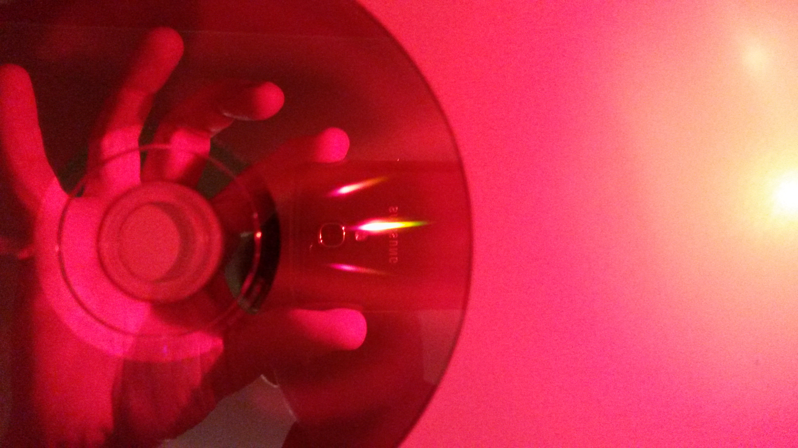
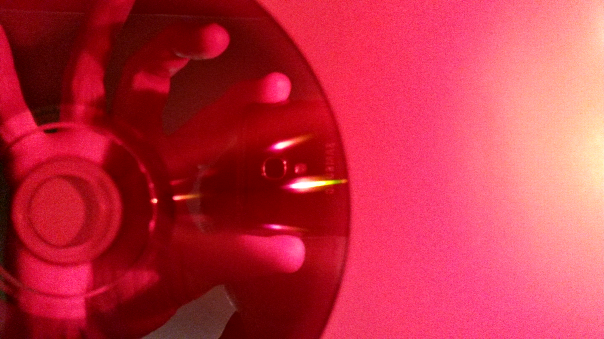

= Replacement evaluation
:toc:
:sectnums:
:toc-placement!:
:toclevels: 2

toc::[]

== Setup

A new setup was made to evaulate the spectrum of the replacement light.

This approach can certainly be questioned for accuracy, especially if this fits in the discussion. But to me it confirms the subjective feeling that "photo red" is not significantly different from other red lights.

Three lights (H501r, H502r, SL) are set up such that their vertical angle to the DVD is almost the same. To achieve this result, the lights are positioned at different distances from the DVD so that their apparent elevation angle is the same when viewing their direct reflection in the DVD.

== DVD gratings

On the two pictures, one can see the three diffraction lines.

* The top one is the 501r
* The middle one is the 502pr
*( The bottom line comes from the Streamlight SideWinder (red LED mode)

Red end of the spectrum is to the left, blue end to the right.

It is obvious that the 502pr has a larger spectral spread, and is LESS shifted to the red end of the spectrum. In other words, a deeper "photo red" result has not been attained.

